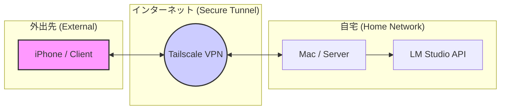

# 添付資料02: 技術スタックとシステム構成

## 1. 推奨技術スタック（iOSアプリ）

自分専用のシンプルアプリを最速で作るための構成。

| 領域 | 技術選定 | 選定理由 |
| :--- | :--- | :--- |
| **言語** | **Swift** | Apple標準。モダンで安全。 |
| **UI** | **SwiftUI** | コード量が少なく、AI生成との相性が抜群。 |
| **IDE** | **Xcode** | 純正ツール。プレビュー機能が強力。 |
| **データ保存** | **@AppStorage** | ユーザー設定や簡易データの保存に最適（コード1行で実装可）。 |

## 2. リモートLLM接続アーキテクチャ

自宅のMacをサーバーとし、外出先のiPhoneから安全にアクセスする構成。

通信フロー
1. Request: iPhoneアプリから http://[Mac-Tailscale-IP]:1234/v1/chat/completions へJSONを送信。
2. Tunnel: Tailscaleが通信を暗号化し、自宅ネットワーク内のMacへ転送。
3. Process: Mac上のLM Studioがリクエストを受け取り、LLMで推論を実行。
4. Response: 生成されたテキスト（またはストリーム）をiPhoneへ返却。
